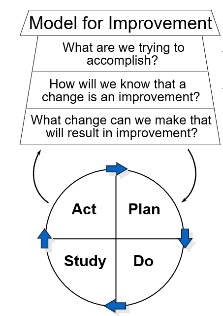

```{r setup, include=FALSE}
knitr::opts_chunk$set(echo = FALSE)
library(tidyverse)
library(patchwork)


good_direction_up <- FALSE

text_y_coord_up <- c(70,50)

text_y_coord_down <- c(50,70)

if(good_direction_up) {
  
  text_y_coord <- text_y_coord_up
  
} else {
  
  text_y_coord <- text_y_coord_down 
}


unit_name <- "Hospital"

caption_main_table <- "Yearly Summary Report:  MT CO2e impact, three hospitals"

measure_topic <- "CO2e from activity X"

y_var_name <- "MT CO2e"

```

### IHI makes a big deal of asking you for numbers

- Our ask:  collect and report data on measures–-monthly or weekly time steps.  
  
- Why? Show evidence that your changes to operations drive changes in performance.

- Numbers help answer Question 2 of the M4I.



<!-- # image from file -->


## Don't Be Fooled by Table Summaries

- The simulated situation:  Hospitals A, B, and C each have summarized tons of CO2e associated with their operations month by month in 2021 and 2022.  

- Each hospital tested and changed operations in December 2021, with the aim of decreasing CO2e emissions.  

- Each of the three hospitals produce *exactly* the same summary table.  

- Does it look like our community should get excited about the impact of December 2021's change?  


```{r make_perla, echo = FALSE, message = FALSE, warning = FALSE}

set.seed(123)
y2 <- round(rnorm(n = 12, mean = 70, sd = 10),0)
y1 <- round(rnorm(n = 12, mean = 30, sd = 10),0) + 10

make_perla_df <- function(y1,y2, good_direction = good_direction_up){
      
  if(good_direction){
      y <- c(y1,y2)
      
      median_y1 <- c(rep(median(y1),12), rep(NA, 12))
      
      median_y2 <- c(rep(NA, 12), rep(median(y2), 12))
      
  } else {
      y <- c(y2,y1)
      
      median_y1 <- c(rep(median(y2),12), rep(NA, 12))
      
      median_y2 <- c(rep(NA, 12), rep(median(y1), 12))
  }   
      
      
      epoch <- c(rep_len("Before", length.out = 12), rep_len("After", length.out = 12))
      
      xA <- seq.Date(from = as.Date("2021-01-01"), length.out = 24, by = "month")
      
      df_perla <- cbind.data.frame(Date = xA, y = y,epoch = epoch, 
                                   median1 = median_y1,
                                   median2 = median_y2)

      t_test_out <- t.test(y1, y2, var.equal=TRUE)
      
      list_out <- list(df=df_perla, t_test = t_test_out)
}


#`DM pts seen by Dental`
# this function uses a data frame that has the structure created
# by the function make_perla_df
p_perla <- function(df, 
                    unit, 
                    enhanced = TRUE, 
                    measure_topic0 = measure_topic, 
                    good_direction = good_direction_up,
                    text_y_coord0 = text_y_coord) {
  p1 <- ggplot(data = df, aes(x = Date, y = y)) +
    theme_bw()+
    geom_point(size = rel(2.5))+
    geom_line()
  
  if(enhanced) {
    p1 <- p1 + labs(title = paste0(unit_name, " ", unit,": ", measure_topic0),
         subtitle = "Change in workflow mid-December 2021",
         caption = "Horizontal lines: 2021 and 2022 monthly medians",
         y = y_var_name) +
    geom_vline(xintercept = as.Date("2021-12-15"), linetype = "dashed")+
    annotate("text", x = c(as.Date("2021-06-15"),as.Date("2022-06-15")),
             y = text_y_coord0, label = c("Before Change", "After Change"))
    
    p1.1 <- p1 + geom_line(data = df, aes(x = Date, y = median1))
  
    p_out <- p1.1 + geom_line(data = df, aes(x = Date, y = median2)) 

      # annotate("segment",x = x_arrow, xend = x_arrow, y = 3, yend = 3.3) +
   if(good_direction) {
    p_out <- p_out + annotate("segment",
        x = as.Date("2021-03-15"), xend = as.Date("2021-03-15"), y = 75, yend = 85,
        colour = "blue", arrow = arrow(type = "closed", length = unit(.2, "cm"))) +  
      geom_text(label = "better", x = as.Date("2021-02-01"), y = 80) 
   } else {
      p_out <- p_out + annotate("segment",
        x = as.Date("2022-03-15"), xend = as.Date("2022-03-15"), y = 85, yend = 75,
        colour = "blue", arrow = arrow(type = "closed", length = unit(.2, "cm"))) +
        geom_text(label = "better", x = as.Date("2022-02-01"), y = 80)
    }
    
  } else {
    p_out <- p1 + labs(title = paste0(unit_name, " ", unit,": ", measure_topic0), y = y_var_name)
  }
  
  return(p_out)
  
}


#Make Case 2:  no effect of change

y1_sort <- sort(y1)

y1_resort <- y1_sort[c(1,3,2,4,5,6,8,7,9,11,10,12)]

y1_resort_rev <- rev(y1_resort)

y2_sort <- sort(y2)

y2_resort <- y2_sort[c(3,2,1,4,6,5,7,8,9,11,10,12)]

y2_resort_rev <- rev(y2_resort)


#Case 3 Decay
y1_new <- sample(y1, 12)
y1_new <- sample(y1_new,12)
y1_new <- sample(y1_new,12)

y2_new <- sample(y2, 12)

y2_decay <- y2[c(7,11,6,3,12,4,2,5,1,9,10,8)]

y1_new_decay <- y1_new[c(12,1,5,8,9,2,3,4,11,10,6,7)]


#case 1 logic handled by make_perla function
case1 <- make_perla_df(y1= y1, y2 = y2)

if(good_direction_up) {
 
  case2 <- make_perla_df(y1= y1_resort, y2 = y2_resort)
  
  case3 <- make_perla_df(y1 = y1_new, y2 = y2_decay)
  
} else {
  case2 <- make_perla_df(y1= y1_resort_rev, y2 = y2_resort_rev)
  
  case3 <- make_perla_df(y1 = y1_new_decay, y2 = y2_new)
  
}

p11 <- p_perla(df = case1$df, unit = "A")

p21 <- p_perla(df = case2$df, unit = "B")

p31 <- p_perla(df = case3$df, unit = "C")
```

```{r table, echo = FALSE, warning = FALSE, message = FALSE}

mean1 <- round(mean(y1),1)

mean2 <- round(mean(y2),1)

median1 <- median(y1)

median2 <- median(y2)

if(good_direction_up) {

  table1 <- data.frame(Year = c("2021", "2022"), Total = 12*c(mean1, mean2), `Monthly Average` = c(mean1, mean2),
                       `Monthly Median` = c(median1, median2))
} else {
  table1 <- data.frame(Year = c("2021", "2022"), Total = 12*c(mean2, mean1), `Monthly Average` = c(mean2, mean1),
                       `Monthly Median` = c(median2, median1))
}

#Make table repeated:  A    B      C
health_center <- c(rep.int("A",2), rep.int("B",2), rep.int("C",2))

table2 <- rbind.data.frame(table1, table1, table1) %>% 
            bind_cols(health_center) 

names(table2)[5] <- unit_name

table2 <- table2 %>% relocate(!!unit_name)
            

knitr::kable(table2, caption = caption_main_table, col.names = c(unit_name, "Year","Total", "Monthly Average", "Monthly Median"))

```

# Plot Dots

## Case A What do you see in the data display?

- The time series graph for Hospital A shows the monthly values summarized in the table on the previous slide.   
- Does the graph support the belief that the change in December 2021 improved performance, 2022 vs 2021?

```{r plain_plot}

p0 <- p_perla(df = case1$df, unit = "A", enhanced = FALSE)

p0

```

# Add Labels

## Case A  Make it easier to see the story in the numbers!

- Does the graph support the belief that the change in December 2021 improved performance, 2022 vs 2021?
- Adding words, the line to mark the change in workflow, and the "better" direction arrow helps you think!

```{r caseA, echo = FALSE, fig.height = 4, warning = FALSE}

p11

```

## Case B  What do you see in the data display?

- Does the graph support the belief that the change in December 2021 improved performance, 2022 vs 2021?

- How does the pattern in this graph differ from the graph of `r unit_name` A's data?

```{r caseB, echo = FALSE, fig.height = 4, warning = FALSE}

p21

```

## Case C  What do you see in the data display?

--Does the graph support the belief that the change in December 2021 improved performance, 2022 vs 2021?

--How does the pattern in this graph differ from the graphs of data from `r unit_name`s A and B?

```{r caseC, echo = FALSE, fig.height = 4, warning = FALSE}

p31

```

## In our collab work, we often show all the `r unit_name`s in one display

- You can shrink graphs to show several in one display; it helps if the scales are all aligned.

- You can quickly compare patterns and look for differences. 

- Here's a stack of the graphs from `r unit_name`s A, B, C.

```{r  summary, echo = FALSE, fig.height = 8, fig.width = 6, warning = FALSE}
#pivot longer and then facet graph to make it look like Shiny

df1 <- bind_rows(case1$df,case2$df,case3$df, .id = unit_name) 

df1[,1] <- gsub("1", "A", df1[,1])
df1[,1] <- gsub("2", "B", df1[,1])
df1[,1] <- gsub("3", "C", df1[,1])

unit_name0 <- dplyr::sym(unit_name)

p_stack <- ggplot(data = df1, aes(x = Date, y = y))+  
              theme_bw()+
              geom_point(size = rel(2.5))+
              geom_line()+
              facet_wrap(unit_name0, ncol = 1)+
              geom_vline(xintercept = as.Date("2021-12-15"), linetype = "dashed") +
            labs(title = measure_topic,
                 subtitle = paste0(unit_name,"s A, B, and C changed operations in Dec. 2021"))
    
#annotate("text", x = c(as.Date("2021-06-15"),as.Date("2022-06-15")),
             #y = c(70,50), label = c("Before Change", "After Change")) 


  p_stack1 <- p_stack + geom_line(data = df1, aes(x = Date, y = median1))
  
  p_stack2 <- p_stack1 + geom_line(data = df1, aes(x = Date, y = median2)) +   theme(strip.text.x = element_text(size = 16)) + labs(y = y_var_name)
  
  if(good_direction_up){
  
     p_out <- p_stack2 +
    
      geom_text(label = "better", x = as.Date("2021-02-01"), y = 80) +

      # annotate("segment",x = x_arrow, xend = x_arrow, y = 3, yend = 3.3) +

      annotate("segment",
        x = as.Date("2021-03-15"), xend = as.Date("2021-03-15"), y = 75, yend = 85,
        colour = "blue", arrow = arrow(type = "closed", length = unit(.2, "cm"))
      )
  } else {
   p_out <- p_stack2 +
    
      annotate("segment",
        x = as.Date("2022-03-15"), xend = as.Date("2022-03-15"), y = 85, yend = 75,
        colour = "blue", arrow = arrow(type = "closed", length = unit(.2, "cm")) +
        geom_text(label = "better", x = as.Date("2022-02-01"), y = 80)
      )
  }
  
p_out
```


## What is the median of a set of values?

The *median* divides the set of values into two equal batches: one batch has values all less than or equal to the median; the other batch has all values greater than or equal to the median.   In other words, the median is the 50% value when you rank order the values from smallest to largest.

You can calculate the median using Excel if you have a lot of numbers.  For example if the values are in cells B2 through B25, choose an empty cell on the same worksheet and type **=median(B2:B25)**.  


## Why do we use medians in our improvement project graphs?

- The median isn't affected by a few whacky values.
- You can calculate the median GRAPHICALLY--it's easy to estimate if it is missing.
- Once you know the median, you can learn to apply a few simple statistical rules.  The rules help you find patterns that are not likely to arise just by chance.  These "low chance" patterns are clues that your operations may have changed--either by something you did on purpose or from some other cause.

::: notes
I can show you the graphical approach on the graph from `r unit_name` A.  Grab a rectangle shape from the insert menu and stretch the top of the box until we get to between the 6th and 7th values in 2021.
:::


## Are you a fan of tables?  Add graphs to see patterns over time.

You can enhance tables of numbers with small charts embedded in table cells.  Formalized by information graphic designer [Edward Tufte](https://en.wikipedia.org/wiki/Sparkline) in 1983 and named by him as "sparkline" in 2006, sparklines are available in Excel, Tableau, PowerBI, table functions in R, etc.

# The Kelleher Rule:  Choose the right time step of your measurement series

::: notes
My colleague Kevin Kelleher taught me a rule of thumb 30 years ago
:::

## What is the appropriate time step for your data series?

*Kelleher's Rule*:  Collect and display data on key system properties at least “one step” faster than your capacity to make decisions and interventions using those data.

Why? Build understanding of system variation; patterns in the data give you clues for adjustments and insight. 

## EXAMPLE  

If you can propose changes to work and analyze performance **weekly** then the time step of your data should be at least **daily**.

Time Steps:   years, quarters, months, weeks, days, 8-hour shifts, hours, ... decrease by a median factor of 4.

::: notes

When you track numbers in a table or add dots to a plot, a daily value gives you a sense of trends or shifts within the week, especially if you have past weeks for reference. This is the logic behind use of specific rules for run charts. 

It’s also usually a good idea not to react to a single data point unless the single point is very unusual. Control charts are one class of tools to judge whether an individual point is unusual enough to justify a rational response through detective work and action. 

Prospectively, if you make a change to the system or process, you’d like to have evidence that the change is working or not relatively quickly—and quickness again is relative to your management capacity. If you have a weekly management stand-up review meeting and make a change on Monday, Kelleher’s rule guides you to get data daily to assess impact of your change to inform next week’s review.

:::

[click here for more discussion of the Kelleher Rule] (https://www.iecodesign.com/blog/2016/8/9/applying-the-kelleher-rule-to-improve-improvement-projects)

## Reference

Perla, R. J., Provost, L. P., Murray, S. K. The run chart: a simple analytical tool for learning from variation in healthcare processes. **BMJ Quality & Safety**, 2011, 20, pp. 46-51.

